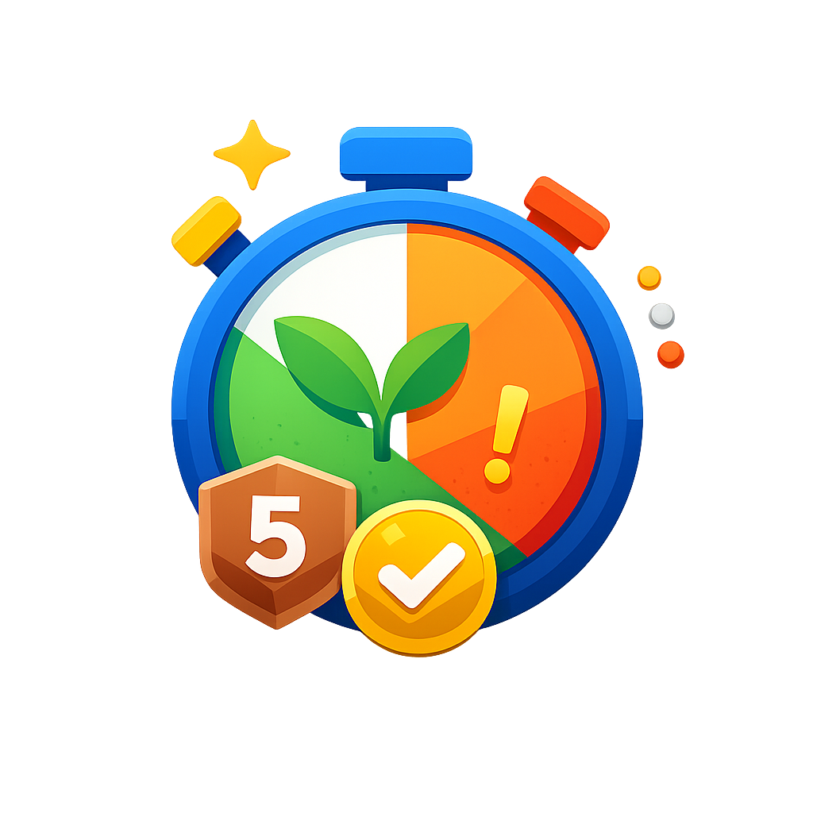

<p align="center">
  
</p>

<h1 align="center">Since</h1>

<p align="center"><strong>Il tuo habit tracker al contrario.</strong></p>

Since ti aiuta a vedere quanto lontano sei arrivato da un'abitudine che vuoi lasciare alle spalle. Crea un percorso, scegli un colore, imposta il momento di inizio e lascia che l'app tenga traccia dei tuoi progressi, dei record e dei traguardi raggiunti.

## Perche Ti Piacera

- **Conta i giorni da cui resisti**  
  Tieni sotto controllo detox, pause digitali, rinunce o cambiamenti personali.

- **Tutto resta sul tuo dispositivo**  
  Since e local-first: i dati sono salvati in IndexedDB, senza account e senza cloud obbligatorio.

- **Funziona anche offline**  
  Essendo una PWA, puoi aprirla e usarla anche senza connessione.

- **Percorsi personalizzati**  
  Scegli nome, icona, colore, data e ora di inizio.

- **Reset consapevoli**  
  Se interrompi una striscia, puoi registrare una nota e conservare la cronologia dei tentativi.

- **Traguardi e badge**  
  Visualizza milestone da pochi giorni fino a 5 anni, con badge motivazionali.

- **Backup semplice**  
  Esporta e importa un file JSON per spostare o ripristinare i dati.

## Pensata Come Un'App Nativa

Since e progettata per sentirsi naturale su mobile:

- bottom navigation compatta
- FAB per creare nuovi percorsi
- animazioni morbide tra le pagine
- picker data e ora custom
- supporto tema chiaro, scuro e sistema
- colore principale personalizzabile
- testo non selezionabile per un'esperienza piu app-like

## Privacy

I tuoi dati restano locali. Since non richiede login, non invia i tuoi percorsi a server esterni e non dipende da servizi cloud per funzionare.

## Ideale Per

- smettere di fumare
- ridurre zuccheri o alcol
- fare pause dai social
- limitare shopping impulsivo
- monitorare detox digitali
- tracciare qualsiasi abitudine da cui vuoi prendere distanza

## Funzionalita Principali

| Area | Funzionalita |
| --- | --- |
| Percorsi | Creazione, modifica, eliminazione con conferma |
| Personalizzazione | Icone, colori, colore app, tema |
| Storico | Reset con note, cronologia tentativi, record massimo |
| Motivazione | Milestone, badge, progressi |
| Sistema | PWA, offline mode, manifest, service worker |
| Dati | IndexedDB, import/export JSON |

## Avvio Locale

```bash
npm install
npm run dev
```

Apri l'app su:

```text
http://localhost:5173/
```

## Build

```bash
npm run build
```

## Tecnologia

Since e costruita con:

- React
- Vite
- Zustand
- IndexedDB
- Lucide Icons
- PWA Manifest
- Service Worker

---

**Since**  
Conta il tempo che ti separa da cio che hai scelto di lasciare indietro.
